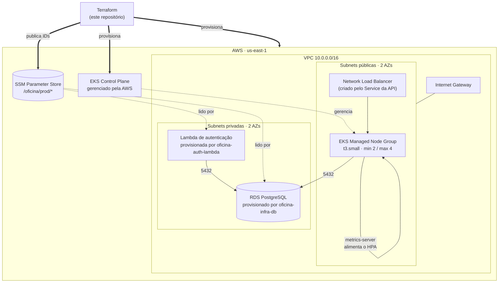

# oficina-infra-k8s

Infraestrutura como código da **rede e do cluster Kubernetes** da Oficina Mecânica.
Repositório 2 de 4 do Tech Challenge — Fase 3.

Esta stack é a base de todas as outras: cria a VPC que o banco e a Lambda usam, o
cluster EKS onde a API roda, e publica os identificadores desses recursos no SSM
Parameter Store para que os demais repositórios os consumam sem acoplamento de state.

| Repositório | Papel |
| --- | --- |
| [oficina-auth-lambda](https://github.com/Xikin/oficina-auth-lambda) | Function serverless de autenticação por CPF + API Gateway |
| **oficina-infra-k8s** (este) | VPC + cluster EKS + metrics-server |
| [oficina-infra-db](https://github.com/Xikin/oficina-infra-db) | RDS PostgreSQL gerenciado |
| [oficina-mvp](https://github.com/Xikin/tech_challenge) | Aplicação principal executando no cluster |

---

## Arquitetura desta stack



### Decisões que valem explicar

**Sem NAT Gateway.** Um NAT custaria ~US$1,10/dia, boa parte do crédito do Learner
Lab. As subnets privadas não precisam de saída para a internet: o RDS não faz
chamadas externas e a Lambda só conversa com o RDS, recebendo segredos por variável
de ambiente injetada no deploy.

**`LabRole` como cluster role e node role.** O AWS Academy Learner Lab bloqueia
`iam:CreateRole`. A `LabRole` já vem na conta com trust para `eks.amazonaws.com` e
`ec2.amazonaws.com`. Numa conta AWS normal isso violaria o menor privilégio — a
variável `lab_role_name` existe justamente para trocar por roles dedicadas.

**metrics-server como addon gerenciado do EKS.** Sem ele o HPA fica com targets
`<unknown>` e nunca escala — a lacuna exata do cluster Kind da Fase 2. A primeira
versão usava Helm, o que obrigava o Terraform a falar direto com o API server do
cluster; como addon, a instalação passa pela API do EKS, com a mesma credencial e o
mesmo caminho de rede das demais chamadas AWS.

**ECR para a imagem da API.** Na Fase 2 a imagem ia para o GHCR e o pull secret era
criado com o `GITHUB_TOKEN`, que expira ao fim do job: pods agendados depois em nós
novos — exatamente quando o HPA e o autoscaling de nós entram em ação — falhavam com
`ImagePullBackOff`. No ECR da própria conta, os nós puxam com a role deles, sem
segredo no cluster.

**`max_size = 4` no node group.** O HPA cria pods; o autoscaling do node group cria
as instâncias que os hospedam. Sem essa segunda camada, `maxReplicas: 10` seria
inatingível — foi o motivo de abandonarmos a proposta de k3s de nó único da RFC-0001.

---

## Tecnologias

| Camada | Tecnologia |
| --- | --- |
| IaC | Terraform ~> 1.10 (backend S3 com lock nativo) |
| Nuvem | AWS — EKS, VPC, EC2, SSM Parameter Store |
| Kubernetes | EKS 1.31, addons `vpc-cni`, `kube-proxy`, `coredns` |
| Autoscaling | EKS Managed Node Group + metrics-server (addon gerenciado) |
| Registro de imagens | Amazon ECR (`oficina-<env>-api`, scan on push, retém 15 imagens) |
| CI/CD | GitHub Actions — `plan` no PR, `apply` no merge |

---

## Pré-requisitos

- Terraform >= 1.10
- AWS CLI v2 autenticado
- `kubectl`
- Uma sessão ativa do AWS Academy Learner Lab

### Credenciais do Learner Lab

O lab entrega credenciais **temporárias que expiram a cada 4 horas**. Em
*AWS Details → AWS CLI*, copie o bloco e cole em `~/.aws/credentials`:

```ini
[default]
aws_access_key_id=ASIA...
aws_secret_access_key=...
aws_session_token=...
```

As mesmas três variáveis viram secrets no GitHub (veja abaixo) e **precisam ser
atualizadas a cada nova sessão do lab** — o pipeline falha com mensagem explícita
quando expiram.

---

## Execução

```bash
# 1. Bucket de state — uma única vez para os três repositórios Terraform
./bootstrap/backend.sh
# anote o nome do bucket que ele imprime

# 2. Inicializar
terraform init \
  -backend-config="bucket=oficina-tfstate-<ACCOUNT_ID>" \
  -backend-config="region=us-east-1" \
  -backend-config="key=infra-k8s/prod/terraform.tfstate"

# 3. Revisar e aplicar (~12 a 15 min: o control plane sozinho leva ~10)
cp terraform.tfvars.example terraform.tfvars
terraform plan
terraform apply

# 4. Apontar o kubectl para o cluster
$(terraform output -raw update_kubeconfig_command)
kubectl get nodes
kubectl top nodes   # só responde depois que o metrics-server sobe
```

### Ordem entre os repositórios

```
oficina-infra-k8s  ->  oficina-infra-db  ->  oficina-mvp  ->  oficina-auth-lambda
   (VPC + EKS)          (RDS na VPC)         (app no cluster)   (Lambda + Gateway)
```

Esta stack vem primeiro porque publica a VPC e as subnets que as outras consomem.

### Destruir entre sessões de estudo

O control plane do EKS custa ~US$0,10/h **mesmo ocioso**. Para preservar crédito:

```bash
terraform destroy
```

ou acione o workflow `Terraform EKS` pelo GitHub com a opção `destroy` marcada.

---

## Deploy automático

| Gatilho | O que acontece |
| --- | --- |
| PR para `main` ou `homolog` | `fmt` + `validate` + `plan`, com o plano comentado no próprio PR |
| Push em `homolog` | `apply` no ambiente de homologação (`environment = "homolog"`) |
| Push em `main` | `apply` no ambiente de produção (`environment = "prod"`) |
| `workflow_dispatch` com `destroy` | `terraform destroy` do ambiente da branch |

Cada ambiente tem sua própria chave de state (`infra-k8s/<env>/terraform.tfstate`),
então homologação e produção são clusters independentes.

### Secrets necessários no repositório

| Secret | Origem |
| --- | --- |
| `AWS_ACCESS_KEY_ID` | Learner Lab → AWS Details → AWS CLI |
| `AWS_SECRET_ACCESS_KEY` | idem |
| `AWS_SESSION_TOKEN` | idem — **expira a cada 4h** |
| `TF_STATE_BUCKET` | saída de `./bootstrap/backend.sh` |
| `NEW_RELIC_LICENSE_KEY` | opcional — instala a integração Kubernetes do New Relic depois do `apply` |

---

## O que esta stack publica no SSM

Outros repositórios leem estes parâmetros com `data "aws_ssm_parameter"`:

| Parâmetro | Consumido por |
| --- | --- |
| `/oficina/<env>/network/vpc_id` | infra-db, auth-lambda |
| `/oficina/<env>/network/public_subnet_ids` | — |
| `/oficina/<env>/network/private_subnet_ids` | infra-db, auth-lambda |
| `/oficina/<env>/eks/node_security_group_id` | infra-db (ingress 5432) |
| `/oficina/<env>/eks/cluster_name` | oficina-mvp (deploy) |
| `/oficina/<env>/eks/cluster_endpoint` | — |
| `/oficina/<env>/ecr/api_repository_url` | oficina-mvp (build e deploy) |
| `/oficina/<env>/api/endpoint` | oficina-auth-lambda (backend do gateway); criado aqui com placeholder e sobrescrito pelo deploy da API |

---

## API

Este repositório não expõe API própria. A API da oficina é documentada em
[oficina-mvp](https://github.com/Xikin/tech_challenge): Swagger em `/docs` e collection Postman versionada
no repositório da aplicação.

## Documentação

- [ADR-0005 — LabRole e as restrições do AWS Academy](docs/adr/0005-restricoes-aws-academy.md)
- [ADR-0007 — EKS gerenciado em vez de k3s de nó único](docs/adr/0007-eks-em-vez-de-k3s.md)
